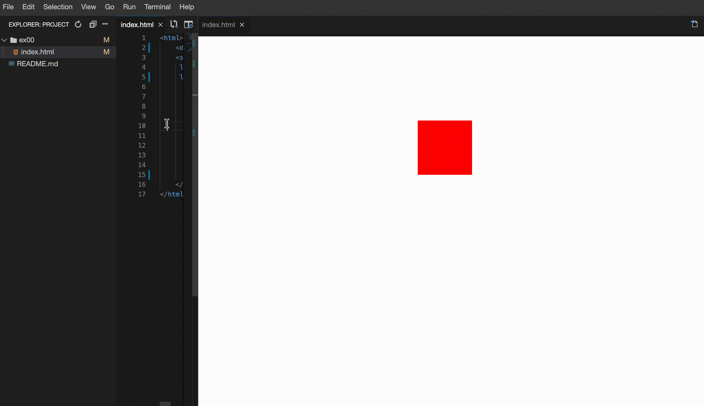
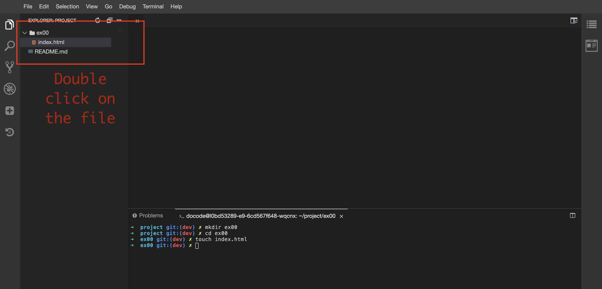
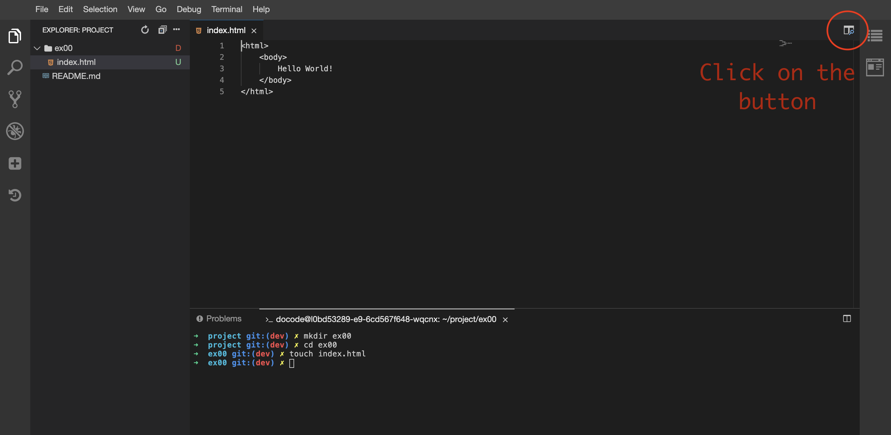
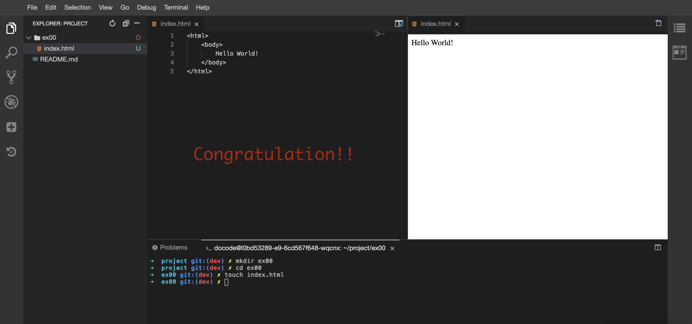

# my_moving_box_realtime

My Moving Box Realtime	
Submit directory	ex00
Submit file	index.html
Description
Complete an index.html file with the missing javascript code in order to move the "div" with the id my_box_realtime to the coordinates of bottom: 0 and right 0. Moving the box must be smooth. This means you will update the position slowly: You can only change the position (vertically and horizontally) by 1 point every 0.5 seconds.

When we load your html page, we should see the box moving diagonally through the screen and it should take 35 seconds to reach its destination.

You cannot change the value of the html. Moving the box needs to be done using javascript.

$>cat index.html
<html>
    

    
</html>
$>
To display your page you will need a static html page renderer (see annex at the bottom).

Example:

Tips
Google: Javascript document getElementById
Google: Javascript change css position
Google: Javascript setInterval
Make sure to not have: <!DOCTYPE html> at the top, it creates some incompatibility with gandalf

Annex: Static Html Page Renderer
How to have a static html page renderer inside Docode:

0# Open your HTML file:

1# Click on the web preview button:

2# You can preview your html:
