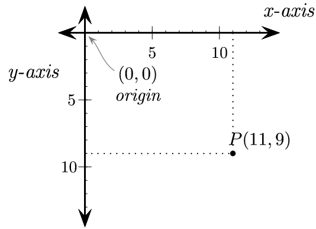

# my_spaceship

My Spaceship	
Submit directory	ex00
Submit file	my_spaceship*
Languages	It needs to be completed in the language you are working on right now. If you are doing Bootcamp Javascript, then javascript (file extension will be .js). If you are doing Bootcamp Ruby, then Ruby (file extension will be .rb). It goes the same for Python, Java, C++, Rust, ...
Description
You have been recently been hired by SpacePro, a new rocket manufacturer, and have been tasked with designing a simulator for their spaceships. This simulator creates a virtual “space” and keeps track of the basic movements and direction of a given ship. Your job is to keep track of where the ship is and it’s orientation relative to its starting point.

Instructions
Your ship simulator must take in a string of letters that represent a planned flight path for a given rocket ship.

In a ship’s flight path there are only 3 valid options for movement; R for turning right, L for turning left and A for advancing.

If, for example, you receive “RRALAA” as your flight path, you should interpret it as the following:
Turn right, turn right, advance, turn left, advance, advance
Once given this initial flight path, your program must return the x,y coordinates of a ship’s final destination as well as it’s orientation relative to the starting point.

Orientation is represented as left, right, up or down.

Space is infinite, so the x,y coordinates you return could be placed on a seemingly infinite grid and can be negative or positive values.

So let's say an upward-facing rocket ship leaves its starting point of 0,0 and is given the flight path of “RRALAA”, its final location will be 2,-1 and it will be facing right.

Your Job
You must create a function that takes in a flight path of a rocket ship as a string of letters and returns the following format:
"{x: X, y: Y, direction: 'DIRECTION'}"
X,Y represent the ending coordinates of your ship and direction represents its final direction.

Notes
Function myspaceship returns a _STRING.

We are using Computer Graphics Coordinate System

All spaceships will start at 0,0 and will face up
Moving left/right will influence X and moving up/down will influence Y

Example 00

Input: "RAALALL"
Output: 
Return Value: "{x: 2, y: -1, direction: 'down'}"
Example 01

Input: "AAAA"
Output: 
Return Value: "{x: 0, y: -4, direction: 'up'}"
Example 02

Input: ""
Output: 
Return Value: "{x: 0, y: 0, direction: 'up'}"
Example 03

Input: "RAARA"
Output: 
Return Value: "{x: 2, y: 1, direction: 'down'}"
Tip
(In C)
In C, you can use snprintf.